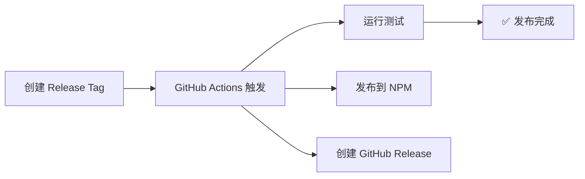

# 🚀 自动发布指南

Claude Code Mailer 现在使用 GitHub Actions 实现完全自动化的发布流程！

## 📋 发布流程概览



## 🎯 发布方法

### 方法1: 使用脚本发布（推荐）

```bash
# 发布 patch 版本（默认）
./scripts/tag-release.sh patch

# 发布 minor 版本
./scripts/tag-release.sh minor

# 发布 major 版本
./scripts/tag-release.sh major
```

### 方法2: 手动创建 Tag

```bash
# 1. 更新版本号
npm version patch/minor/major

# 2. 推送 tag
git push origin --tags
```

### 方法3: GitHub Actions 手动触发

1. 访问: https://github.com/LuRenJiasWorld/Claude-Code-Mailer/actions
2. 点击 "CI and NPM Publish" 工作流
3. 点击 "Run workflow"
4. 选择发布类型并运行

## 🔧 配置要求

### 1. GitHub Secrets

确保你的 GitHub 仓库设置了以下 secrets:

- `NPM_TOKEN`: npm 自动发布令牌

**获取 NPM_TOKEN:**
```bash
npm login
# 然后在 ~/.npmrc 中找到 token
# 或者在 npm 网站创建 Access Token
```

### 2. 权限设置

GitHub Actions 需要以下权限:
- `contents: read` - 读取代码
- `id-token: write` - 发布到 npm

## 📊 发布流程详情

### 自动化步骤

1. **✅ 代码检查**: 验证工作目录干净
2. **✅ 版本更新**: 自动更新 package.json
3. **✅ 创建 Tag**: 创建 Git tag 并推送到远程
4. **✅ 运行测试**: 在多个 Node.js 版本下测试
5. **✅ 发布到 NPM**: 自动发布到 npm registry
6. **✅ 创建 Release**: 从 CHANGELOG.md 生成发布说明

### GitHub Release 内容

自动生成的 Release 包含:
- 📦 包名和版本信息
- 📋 从 CHANGELOG.md 提取的更新说明
- 🚀 安装指令
- 🤖 自动化标识

## 🎉 发布后检查

发布完成后，检查以下项目:

1. **NPM 包**: https://www.npmjs.com/package/claude-code-mailer
2. **GitHub Releases**: https://github.com/LuRenJiasWorld/Claude-Code-Mailer/releases
3. **包下载**: `npm install -g claude-code-mailer@latest`

## 🔍 故障排除

### 常见问题

**Q: 发布失败怎么办？**
A: 检查 GitHub Actions 日志，确认:
- NPM_TOKEN 是否正确设置
- 版本号是否正确
- 测试是否通过

**Q: 如何回滚发布？**
A: 
1. 删除 tag: `git tag -d v1.3.3 && git push origin :v1.3.3`
2. 从 npm 撤销: `npm unpublish claude-code-mailer@1.3.3`

**Q: 如何查看发布状态？**
A: 访问 GitHub Actions 页面查看实时日志

### 手动干预

如果自动化流程失败，可以手动执行:

```bash
# 发布到 npm
npm publish

# 创建 GitHub Release
gh release create v1.3.3 --title "Version 1.3.3" --notes "$(awk '/## \[1.3.3\]/,/^## \[/' CHANGELOG.md | head -n -1)"
```

## 📈 最佳实践

1. **保持 CHANGELOG 更新**: 每次发布前更新 CHANGELOG.md
2. **测试充分**: 确保所有测试通过
3. **版本规范**: 遵循 Semantic Versioning
4. **备份重要**: 重要发布前备份代码
5. **文档同步**: 更新 README 和其他文档

---

🎉 现在你可以享受完全自动化的发布体验了！